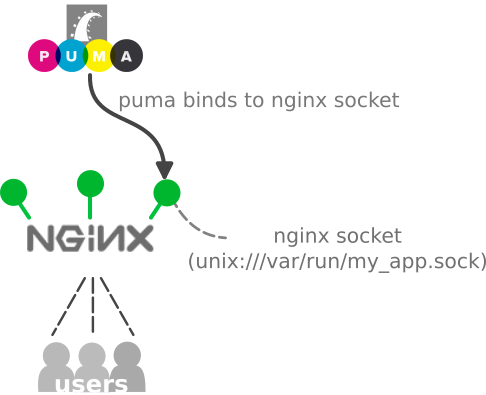
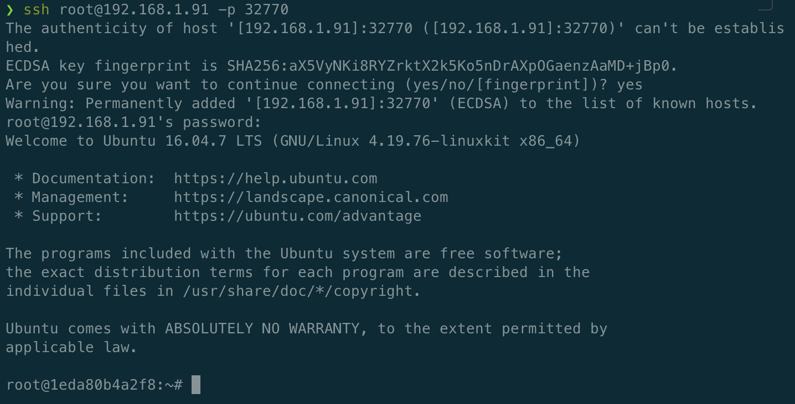
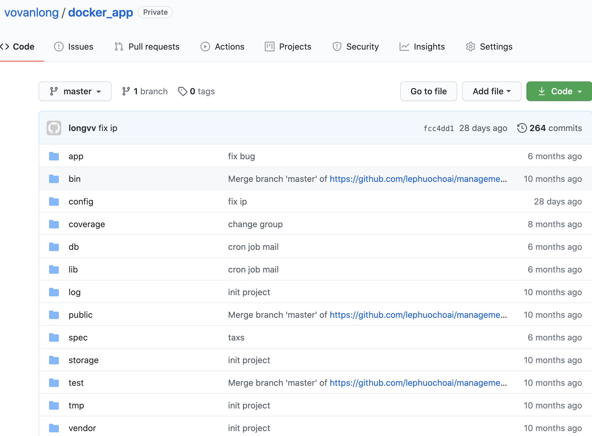
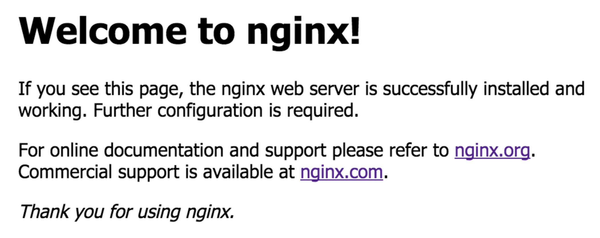
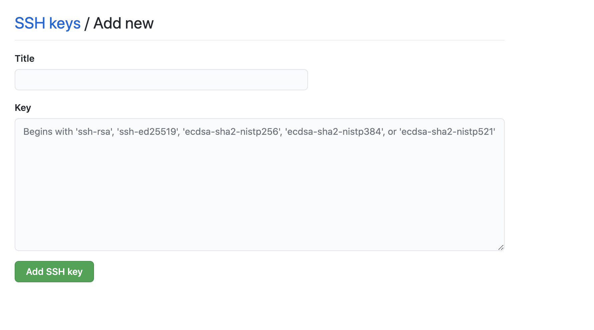
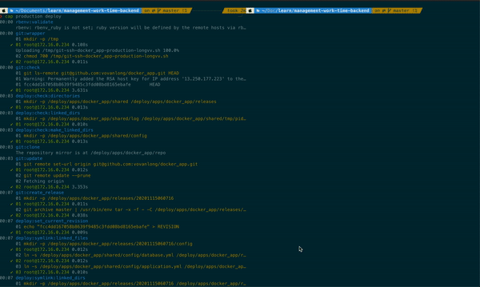

# How to deploy Rails App by Capistrano gem, Puma, Nginx

Khi là một thực tập sinh Ruby on Rails, mình được chỉ định làm một trang web được viết bằng Ruby on Rails. Trước ngày đem sản phẩm đi demo, mình và Trainer có review lại sản phẩm của mình lúc đó mình run web dưới local. Trainer muốn mình triển khai sản phẩm của mình lên môi trường server. Trainer cấp cho mình một con VPS (Virtual Private Server) và hướng dẫn mình deploy sản phẩm của mình lên môi trường server bằng Capistrano gem. Sau khi tìm hiểu và Setup mình đã deploy được sản phẩm của mình.

## Deploy là gì? Tại sao lại cần Capistrano

Deploy là một công việc được đưa code của sản phẩm mình làm ra đưa lên môi trường server, chúng ta config như thế nào để cho sản phẩm của mình chạy được trên đó. Đôi lúc có những công đoạn như đưa code từ bộ quản lý source (github, gitlab, ...), config database, cài đặt môi trường, chạy rake task,... các công đoạn này được lặp đi lặp lại rất nhiều lần sẽ rất là vất vả nếu thực hiện nó bằng tay, mà giả xử những công đoạn này bị lỗi ở một chỗ nào đó thì tốn rất nhiều time để fix lỗi đó, khi đó người dùng sẽ rất thất vọng khi sản phẩm này đang bị lỗi. Thì Capistrano gem nó được sinh ra để tự động hóa các công đoạn trên. Capistrano còn cho phép chúng ta deploy code lên nhiều server cùng một lúc, rollback nếu deploy lỗi, lưu trữ các bản deploy gần đây nhất, chạy custom task trong quá trình deploy. Việc deploy với gem Capistrano gồm 3 bước:

- Tạo môi trường trên server
- Config cho Capistrano
- Config Nginx (webserver)
- Config các lại các bước deploy

Một điều mình thích dùng Capistrano để deploy là bởi vì Capistrano nó rõ ràng trong từng phân đoạn, cấu trúc config của nó rất dễ hiểu để chúng ta config, không bị delay app trong quá trình deploy app

## Công thức deploy app Ruby on Rails với Capistrano, Puma và Nginx

Mình có đọc một bài trên Viblo, thì anh này nghiên cứu khá là sâu nên đã đúc kết ra được một cái công thức deploy cơ bản:

```
Deploy = Config Server(giống như 1 máy local) + Config Capistrano + Config Nginx
```

Công thức trên để phục vụ cho các bước lằng nhằng sau đây. Mình sẽ phân tích rõ ràng từng công đoạn.

OK. Bây giờ triển luôn nào.

## Các bước deploy rails app lên server bằng Capistrano gem

### Step 1: Tìm hiểu một số kiến thức

- Puma
- Nginx

Puma là web server nhỏ gọn đi liền trong Rails giúp developer có thể bắt đầu code một cách nhanh nhất. Tuy nhiên mang nó làm web server thực sự để chạy trên môi trường production thì chưa ổn.

Puma hoạt động như application server cho ứng dụng Rails, còn Nginx sẽ hoạt động với vai trò là reverse proxy - nhận request và chuyển response giữa client và Puma. Puma và Nginx giao tiếp với nhau thông qua socket.



### Step 2: Chuẩn bị môi trường

Nếu các bạn có điều kiện thì có thể thuê VPS ở các nhà cung cấp như AWS - Amazon Web Service, DigitalOcean, Azure, Google Cloud Platform, ...
các bạn có thể tham khảo và thuê lấy một cái.

Do một số điều kiện không cho phép nên ở bài viết này mình sẽ sử dụng một con VPS (Virtual Private Server) được tạo bằng Docker. Mọi người có thể tham khảo [bài viết](https://github.com/vovanlong/docker-document) này.

Khi mọi người có được một con VPS (Virtual Private Server) của nhà cung cấp, các bạn sẽ được thêm một số thông tin để chúng ta connect vào.


Sử dụng lệnh
```
rails new docker_app
```

Để tạo một project deploy, hoặc nếu có sẵn thì càng tốt. Xong rồi ta push lên bộ quản lý source code (github, gitlab, ...)


Cài đặt một số môi trường, cấu hình cho con server giống như ở máy local, các cầu hình cơ bản như:

- rbenv
- Ruby
- Rails
- MySql
- Git
- Redis
- Nginx

Nói chung cài những thứ mà project của các bạn cần mà dưới local của các bạn chạy được là được.

Lưu ý: Khi các bạn cài MySql xong chúng ta nên tạo trước một database sẵn cho ứng dụng.

```
mysql -u root -p
Nhập password vào
Gõ lệnh này
CREATE DATABASE <your_database_name> CHARACTER SET utf8mb4 COLLATE utf8mb4_unicode_ci;
```

Tên database các bạn cần đế để lát nữa còn config vào file database.yml nhé OK như thế là xong.

### Step 3: Tạo cấu trúc thư mục deploy trên server

Capistrano gem sẽ cấu trúc thư mục cho chúng ta. Bước này chúng sẽ tạo ra folder deploy riêng của project của chúng ta.

```
$ mkdir /deploy
$ mkdir /deploy/apps
$ mkdir /deploy/apps/docker_app
$ sudo chown -R www:root /deploy/apps/docker_app
$ mkdir /deploy/apps/docker_app/shared
$ mkdir /deploy/apps/docker_app/shared/config
```

Muốn connect database vô rails app của chúng ta, mình sẽ tạo ra một file database.yml trong thư mục shared

```
$ vim /deploy/apps/docker_app/shared/config/database.yml
```

Giống ở dưới local chúng ta sẽ add chúng attributes cần thiết vào.

```
production:
  adapter: mysql2
  encoding: utf8mb4
  pool: 5
  database: <your_database_name>
  username: root
  password: <your_mysql_password>
  socket: /var/run/mysqld/mysqld.sock
```

Tiếp theo là file `application.yml`, file này thường chúng hay để các biến môi trường private.

```
$ vim /deploy/apps/docker_app/shared/config/application.yml
```

Ta cũng add những attributes cần thiết vào trong này. Như ở local

```
SECRET_KEY_BASE: "<your_secret_key_base>"
settings:
  info:
    name: MyAppName
    domain: example.com
  database:
    email: mail@example.com
    phone: 1234567890
```

Chúng ta cần tạo một `SECRET_KEY_BASE`, để tạo ở dưới local chúng ta gõ lệnh này vào terminal `RAILS_ENV=production rake secret` rồi dán vào file application.yml.

### Step 4: Cấu hình project trên server

Chúng ta cần cấu hình trước cho thằng nginx, mình nghĩ các bạn chưa biết đến về nginx nên tìm hiểu thêm về nginx, vì nó khá là quan trọng.

Lệnh cài nginx:
```
$ sudo apt-get install nginx
```

Sau đó remove giá trị mặc định của nó đi, chúng ta sẽ tạo giá trị khác sau:

```
$ sudo rm /etc/nginx/sites_enabled/default
```

Đây là lí do mình khuyên các bạn tìm hiểu trước về nginx, nếu các bạn chưa hiểu về nó thì sẽ gặp trường hợp của mình trước đây đó là dù các bạn config đúng như thế nào thì nó vẫn vào config default

Màn hình default của nginx sẽ ra thế này:



Sau khi xoá xong, mình tạo một file mới

```
$ sudo vim /etc/nginx/conf.d/default.conf
```

Sau đó coppy đoạn ở dưới này vào trong file default.conf

```
upstream app {
  # Path to Puma SOCK file, as defined previously
  server unix:/deploy/apps/docker_app/shared/tmp/sockets/puma.sock fail_timeout=0;
}

server {
  listen 80;
  server_name localhost;

  root /deploy/apps/docker_app/current/public;

  try_files $uri/index.html $uri @app;

  location / {
    proxy_set_header X-Forwarded-Proto $scheme;
    proxy_set_header X-Forwarded-For $proxy_add_x_forwarded_for;
    proxy_set_header X-Real-IP $remote_addr;
    proxy_set_header Host $host;
    proxy_redirect off;
    proxy_set_header Connection '';
    proxy_pass http://app;
    proxy_read_timeout 150;
  }

  location ~ ^/(assets|fonts|system)/|favicon.ico|robots.txt {
    gzip_static on;
    expires max;
    add_header Cache-Control public;
  }

  error_page 500 502 503 504 /500.html;
  client_max_body_size 4G;
  keepalive_timeout 10;
}

```

Đoạn loằng nhằng trên trông có vẻ khó hiểu. Đây là file config để connect giữa webserver tới rails app. Tức là nó muốn tìm đến puma để connect giữa nginx và puma lại với nhau.

Chúng ta chỉ cần quan tâm 3 dòng này

```
listen 80;
```

App của chúng ta sẽ chạy ở port 80, có thể thay đổi tuỳ chỉnh.

```
server unix:/deploy/apps/docker_app/shared/tmp/sockets/puma.sock fail_timeout=0;
```

Capistrano sẽ tạo cho chúng ta một cấu trúc của một rails app ở trong đường dẫn này `/deploy/apps/docker_app/`, đoạn trên là đường dẫn để dẫn đến puma. Vì cái này sẽ tạo ra sau khi chúng ta deploy nên chúng ta sẽ không thấy file đó.

```
root /deploy/apps/docker_app/current/public;
```

Tiếp theo đoạn sau khi ta deploy nó sẽ sinh ra trong thư mục `docker_app`, đoạn này là nơi Nginx gởi request đến rails app của chúng ta để xử lý

Sau khi setup xong, chúng ta cần phải reload lại nginx để nginx nhận được sử thay đổi mà chúng ta vừa config

```
$ sudo service nginx restart
```


### Step 5: Authentication Git Repository (github) với server và máy host với server

#### Đầu tiên chúng ta cần xác thức Git Repository với server (VPS).
Vì sao có việc này?

Chúng ta hay quản lý source code (Git Repository) của mình bằng git và nơi chúng ta thường dùng Git Repository là github (có thể gitlab, bitbucket, ...), ở đây nhánh master là nhánh luôn luôn phải đúng, mà luôn đúng thì ta thường show ra, thì nhánh master ta cần phải luôn luôn deploy nếu có sự thay đổi. Việc xác thực giữ github và server ở đây là để capistrano lấy code từ nhánh master trên github để deploy lên server.

Để xác thực, trên server chúng tạo một ssh key bằng lệnh

```
$ ssh-keygen -t rsa -b 4096 -C "your_email@example.com"
```

Để show ra ssh key chúng ta mới tạo:

```
cat ~/.ssh/id_rsa.pub
```


Chúng ta coppy đoạn loằng nhằng, lên github tạo một request add ssh key.



#### Tiếp theo xác thực máy host với server
Tại sao có bước này?

Để deploy rails app từ github lên server, chúng ta cần bắt event để capistrano biết bạn muốn lấy code từ nhánh master của github deploy lên server.

Thường cách bắt event đơn giản nhất, là từ dưới local (máy host) ta gõ lệnh
```
$ cap production deploy
```

Thì capistrano trên server sẽ nhận lệnh này sẽ tự động lấy code mới nhất ở master pull về máy server để deploy.

Cách này trong thực tế, sau khi review code xong và ok tất cả mọi thứ, rồi merge code vô branch master, dưới máy local ta gõ lệnh trên thì deploy lên server. Đôi lúc mình hay đi ra ngoài coffee không đem máy host, mà KH lại cần gấp, lúc đó phải bỏ ly coffee chưa kịp uống đành đạch chạy về deploy. Vì quá ức ly coffee chưa kịp uống. Mình lên github setup CI/CD của Github Action, bắt event khi nào review code xong và merge code xong là deploy luôn, phải phải vát theo cái máy host nữa. :))))

Ở demo này mình sẽ dùng cách thủ công. Để xác thực máy host và server ta gõ lệnh này

```
ssh-copy-id <user>@<address_ip> -f

or

ssh-copy-id  <user>@<address_ip> -p <port> -f
```

Kết quả


Và bây giờ, chúng ta có thể ssh lên server mà không cần gõ password nữa.

### Step 6: Setup project ở dưới local

Chúng ta sẽ sử dụng gem Capistrano để hỗ trợ việc deploy. Coppy cái này vào Gemfile:

```
gem 'capistrano', '>=3.12.0'
gem 'capistrano3-puma'
gem 'capistrano-rails', require: false
gem 'capistrano-bundler', require: false
gem 'capistrano-rbenv'
```

Sau đó 
```
$ bundle install
```

Rồi chạy lệnh để cài đặt Capistrano:
```
$ cap install
```

Sau khi chạy lệnh trên nó sẽ sinh ra cho chúng ta các file: deploy.rb, deploy/staging.rb, deploy/production.rb,..

Các file staging.rb, production.rb chẳng qua chỉ là chia ra để dễ phân biệt các môi trường. Ở đây chúng ta chọn môi trường deploy là production nên sẽ set giá trị config vào thằng production.rb

Mở file deploy.rb lên và copy đoạn bên dưới vào

```
# config valid for current version and patch releases of Capistrano
lock "~> 3.14.1"

set :application, "docker_app"
set :repo_url, <your_url_remote_github>

set :pty, true
set :linked_files, %w(config/database.yml config/application.yml)
set :linked_dirs, %w(log tmp/pids tmp/cache tmp/sockets vendor/bundle public/system public/uploads)
set :keep_releases, 5
set :rbenv_path, '/usr/local/rbenv'
set :puma_rackup, -> { File.join(current_path, "config.ru") }
set :puma_state, -> { "#{shared_path}/tmp/pids/puma.state" }
set :puma_pid, -> { "#{shared_path}/tmp/pids/puma.pid" }
set :puma_bind, -> { "unix://#{shared_path}/tmp/sockets/puma.sock" }
set :puma_conf, -> { "#{shared_path}/puma.rb" }
set :puma_access_log, -> { "#{shared_path}/log/puma_access.log" }
set :puma_error_log, -> { "#{shared_path}/log/puma_error.log" }
set :puma_role, :app
set :puma_env, fetch(:rack_env, fetch(:rails_env, "production"))
set :puma_threads, [0, 8]
set :puma_workers, 0
set :puma_worker_timeout, nil
set :puma_init_active_record, true
set :puma_preload_app, false
```

Ở đây các bạn chỉ cần quan tâm 2 dòng đó là:

```
set :application, "docker_app"
set :repo_url, <your_url_remote_github>
```

- set :application : đặt tên cho ứng dụng của bạn, nên điền tên ứng dụng vào đây.
- set :repo_url: link đến repository chứa source code, của mình hiện tại đang là trên github Các bạn cần sửa trỏ đến project của các bạn là ok.

Tiếp theo file `config/deploy/production.rb`
Mình sử dụng môi trường production chứ không xài staging để test.

```
set :stage, :production
set :rails_env, :production
set :deploy_to, "/deploy/apps/docker_app"
set :branch, :master
server <server_ipv4_public_ip>, user: <your_user>, roles: %w(web app db)
```

Đối với mình sẽ là `server "172.16.0.234", user: "root", roles: %w(web app db), port: 32770`

Do server mình phải dùng port mới connect được server nên mình thêm một option port nữa, nếu mọi người dùng port default 80 thì không cần phải thêm.

Các bạn lưu ý thêm một điểm đó là nơi mà chúng ta sẽ deploy app đó là ở đây :
```
/deploy/apps/docker_app
```

Điều đáng lưu ý trong quá trình deploy đó là lộ thông tin cần private, cho nên những file này set biến môi trường thì chúng ta cần vứt vào trong file .gitignore, chúng ta sẽ set nó sau trên server

```
# Ignore bundler config.
/.bundle

# Ignore all logfiles and tempfiles.
/log/*
/tmp/*
!/log/.keep
!/tmp/.keep

# Other
config/database.yml
public/*
.env
coverage/
.rspec

config/settings.local.yml

config/settings.local.yml
config/settings/*.local.yml
config/environments/*.local.yml
```

### Step 7: Deploy

Sau khi cấu trúc xong 6 bước "thần thánh" trên bước vào giai đoạn tận hưởng đó là deploy.

```
cap production deploy
```



Kết quả


EZ mọi người nhỉ :))))))

## Chốt bài viết

Qua đây mình đã giới thiệu cho mọi người cách setup, config, deploy việc sử dụng gem capistrano để deploy.
Vì nó hỗ trợ chúng ta khá nhanh trong việc deploy rails app, nên chúng ta sẽ bỏ qua các bước setup của nó. Mọi người sau tìm hiểu sâu thêm nó sau khi deploy ok nhé. :)))))

